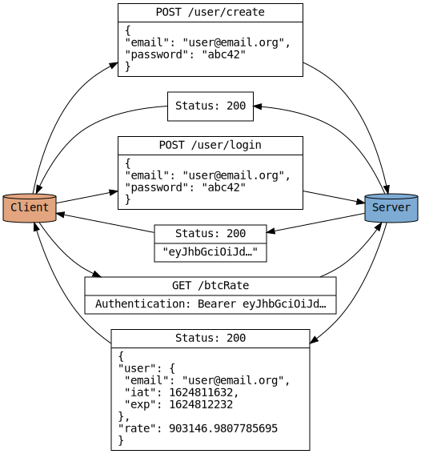

### Overview

The application runs on Node.js and uses the Express framework for routing,
[the bcrypt library](https://github.com/kelektiv/node.bcrypt.js) to encrypt
user credentials, and [JSON web
tokens](https://github.com/auth0/node-jsonwebtoken) for authentication. The
bitcoin conversion rate is provided by [the Coinpaprika API
client](https://github.com/coinpaprika/coinpaprika-api-nodejs-client).

The client-server interaction looks like this:

> If you use the GitHub's dark theme, click
> [here](https://raw.githubusercontent.com/Kharacternyk/se-school-lab/master/client-server.svg)
> to see the image on a light background.

### Quality Assurance

`npm test` runs [an end-to-end test](tests/end-to-end.test.js), as well as [a
property based test](tests/models/user.test.js) (a unit test with random
inputs) of the user model. The former creates a user, logins, and accesses the
conversion rate (and tries unauthorized actions which it expects to fail) via
the three endpoints, while the latter makes sure that every valid email address
is accepted, every login attempt with an invalid password fails, etc. A GitHub
action has been setup to run the tests on the tip of the master branch.

The API can also be manually tested with an HTTP client, e.g., `curl` or
Postman.  In this case, the authorization header must be in the form of `Bearer
[JSON WEB TOKEN]` whilst accessing the /btcRate endpoint. Another thing to keep
in mind is that the tokens are configured to expire in ten minutes by default.
This can be changed via the second parameter of the App constructor in
[index.js](index.js) (pass `null` to disable the expiration).

### Database Implementation

A directory with files and subdirectories is maintained. An email address is
mapped onto a pathname in the directory via the following algorithm:

1. Escape `/` characters in the address.
2. If the length of the escaped address is not greater than the filename length
   limit (255), the address is kept as the name of a single file; otherwise,
   subdirectories are created as needed.

The files contain password hashes of the respective users.

The database directory is passed as the third parameter to the App constructor
in [index.js](index.js).
